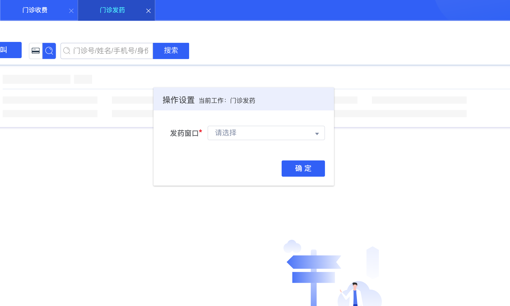
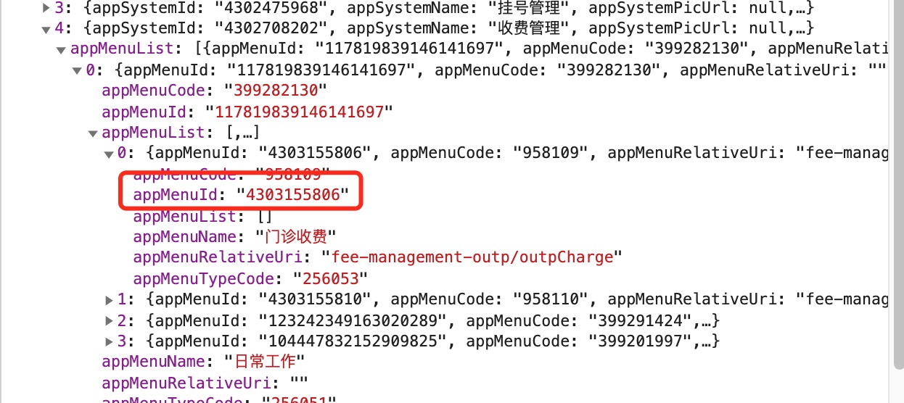
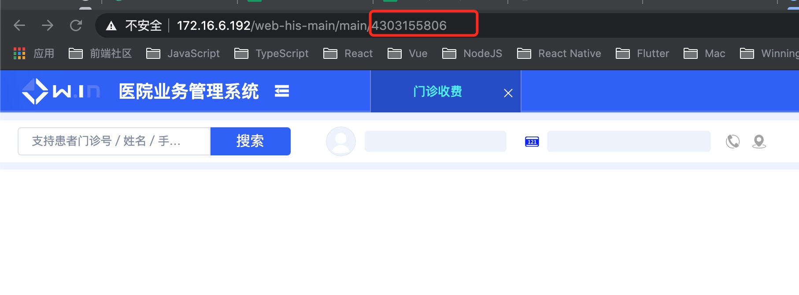

### 获取/设置大his页面设置项公共弹窗

大his框架下，个子页面的设置项由主应用统一设置，子应用如需获取，需要调用主应用提供的方法`getActionSettingValueByConceptId`。




### getActionSettingValueByConceptId

- getActionSettingValueByConceptId
    - type:Function
    - params: String | Array
    - return: Promise<String | Array>

getActionSettingValueByConceptId默认返回一个`promise`，如该设置项已经设值，则直接返回value值，如该设置项未设置，则弹出设置项选择弹窗，点击确定弹窗关闭后resolve设置项的value值。

**参数说明：调用该函数需要传入具体的设置项的conceptId，具体值请找产品刘春咨询，建议将其值定义常量存于项目中，方便后期修改和调用。目前支持传入String和Array。**

示例：
```js
const { getActionSettingValueByConceptId } = this.$root.microAppState // 从主应用获取接口
const defaultChrgWinId = await getActionSettingValueByConceptId(CHARG_WINDOW_CONCEPT_ID)
```

### 开发环境使用
  由于该功能与菜单menuId强相关，因此请在主应用中的菜单接口返回的数据中查找到自己菜单页面的menuId
  

  

  如果项目已部署则可直接在213上访问该页面，copy地址栏中的数字字符串即可。
  

  将此id替换至service.config.js中配置的该项目的appMenuId
  

### 生产环境使用
  无效额外配置

#### 错误提示

- `获取操作设置项数据失败，无效的操作设置项概念标识: xxxxxx`
此报错说明传入的设置项的概念标识不正确，请联系相关人员获取正确的概念标识。

- `获取设置项值失败`
此报错说明没有获取到设置项的value值，可能是后端接口返回异常，此时先联系本人（强峰）筛查是否是前端原因。

