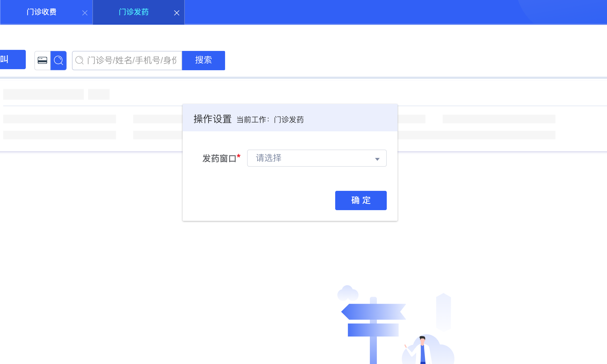
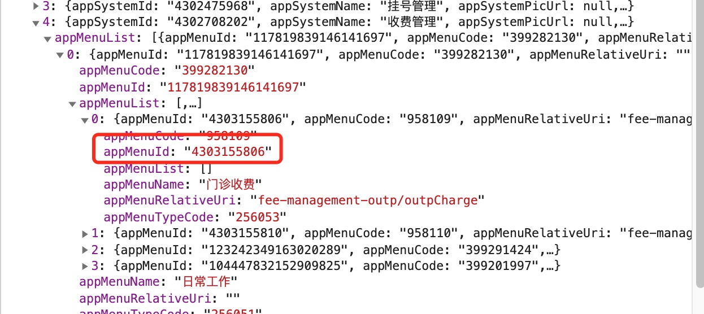
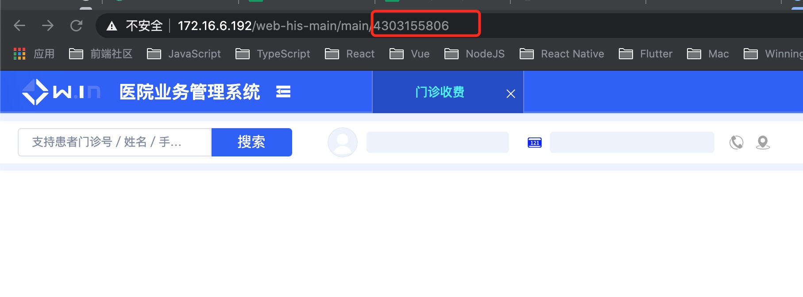
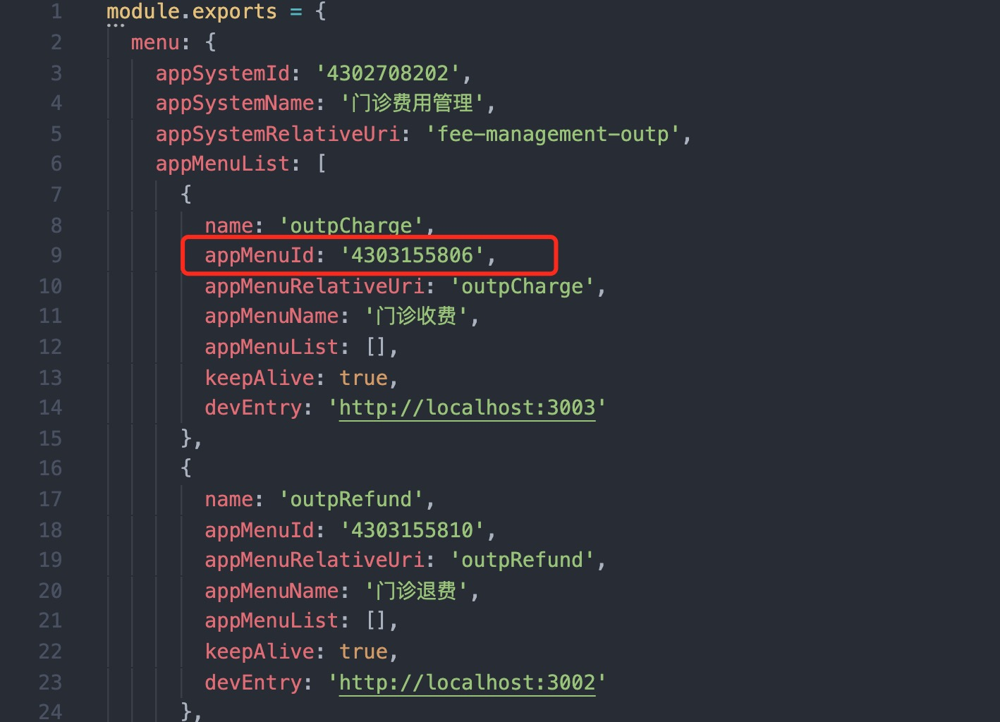

<!--
 * @Author: smallalso<hu141418@gmail.com>
 * @Date: 2020-12-18 13:51:23
 * @LastEditors: smallalso<hu141418@gmail.com>
 * @LastEditTime: 2020-12-24 15:07:59
 * @FilePath: /his-doc/docs/guide/api.md
-->

## API 介绍

这里主要是主应用 `his-main` 提供给子应用的api 使用文档

### 主应用提供的方法和数据

- appSystemId - string 子应用系统ID
- menuId - String 子应用菜单id
- microAppEntry - String 子应用entry地址(qiankun)
- microAppName - String 子应用的name(qiankun)
- EventEmit - Function 发布订阅器,用于和主应用消息通信
- getActionSettingValueByConceptId - Function 获取公共设置项value值

如何使用

### 一. 子应用获取主应用入参数（调用$root）

示例： 获取公共设置项value值

```javascript
const { getActionSettingValueByConceptId } = this.$root.microAppState
```


### 二. 主应用与子应用通信方式

目前主框架采用EventEmit与子应用相互通信，主应用对外暴露了EventEmit，子应用可接收调用$emit或者$on通信

__1. 不同子应用相互跳转__

事件：
- OPEN_HIS_MENU ： 打开子应用菜单，适用于子页面之间需要跳转的需求

``` javascript
// 第一步，跳转目标页面path 
const url = '/web-adt-outpatient/schedulePlay/'

// 第二步，通过$root获取主应用注入的EventEmit
const { EventEmit } = this.$root.microAppState

// 第三步，规定的打开子菜单的消息类型是OPEN_HIS_MENU,使用EventEmit向主应用发送OPEN_HIS_MENU消息,并发送需要调转的URL
EventEmit.$emit('OPEN_HIS_MENU', url, query?string)
```
参数说明：
- url - String 必须 需要跳转的页面地址
- query - String 可选 其他参数，例如：需要跳转的页面有子路由，需要跳转定位到具体的子路由，则使用此字段

```javascript
EventEmit.$emit('OPEN_HIS_MENU', url, '#/scheduleDetail?tab=0')
```

__开发环境__:
由于开发环境中配置的微应用的entry为http:localhost:xxxx,因此要想在开发环境中查看效果，则需要将URL换成需要跳转的菜单的开发环境入口URL

__2. 获取/设置大his页面设置项公共弹窗__

>大his框架下，各子页面的设置项由主应用统一设置，子应用如需获取，需要调用主应用提供的方法  `getActionSettingValueByConceptId`

getActionSettingValueByConceptId默认返回一个promise，如该设置项已经设值，则直接返回value值，如该设置项未设置，则弹出设置项选择弹窗，点击确定弹窗关闭后resolve设置项的value值

__参数说明：__ 调用该函数需要传入具体的设置项的conceptId，具体值请找产品刘春咨询，建议将其值定义常量存于项目中，方便后期修改和调用。目前支持传入String和Array。



示例：
```javascript
// 从主应用获取接口
const { getActionSettingValueByConceptId } = this.$root.microAppState
/*
* @type { Function }
* @params { String | Array }
* @return { Promise<String | Array> }
*/
const defaultChrgWinId = await getActionSettingValueByConceptId(CHARG_WINDOW_CONCEPT_ID)
```
<br/>

__错误提示__

- 获取操作设置项数据失败，无效的操作设置项概念标识: xxxxxx 此报错说明传入的设置项的概念标识不正确，请联系相关人员获取正确的概念标识。
- 获取设置项值失败 此报错说明没有获取到设置项的value值，可能是后端接口返回异常，此时先联系本人（强峰）筛查是否是前端原因。

__本地开发__

>由于该功能与菜单menuId强相关，同时本地开发时，menuId 并不是来源于接口，而是 `service.config.js` 配置中的 menu 字段，所以确保本地开发时 service.config.js appMenuId 正确尤为重要

__第一步：__ 找到正确的菜单页面的menuId

在主应用中的菜单接口返回的数据中查找到自己菜单页面的menuId



如果项目已部署则可直接在213上访问该页面，copy地址栏中的数字字符串即可



__第二步:__ 将此id替换至service.config.js中配置的该项目的appMenuId



### 最后

如需新增功能接口，请联系作者（强峰）
