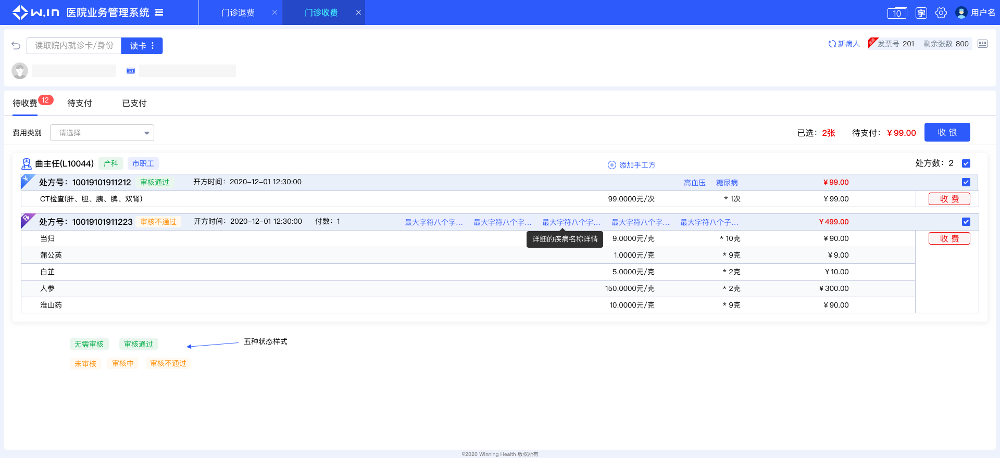

<!--
 * @Author: smallalso<hu141418@gmail.com>
 * @Date: 2020-12-14 22:27:13
 * @LastEditors: smallalso<hu141418@gmail.com>
 * @LastEditTime: 2020-12-18 17:21:32
 * @FilePath: /his-doc/docs/guide/index.md
-->

## 开始

项目背景和技术方案

### 背景

由于2020年5月份公司提出大his的概念，整合费用、物品、就诊、患者四个业务域为大his研发部。同时产品考虑到his产品的一致性，操作便利性和可配置的his产品功能模块，所以将所有分散的独立系统整合为一个大的按需配置的系统方案提出来了。

没错，就是你现在看到的医院管理系统！

__需实现__
- 不同系统的功能菜单自由组合成新的系统（用户可以将不同系统的功能菜单组合成它的日常使用系统）
- 大 his 系统之间能够随意切换（避免用户切换系统需要回到 portal 页面然后重新进入某个系统）
- 大 his 功能模块之间能够相互跳转
- 大 his 头部导航菜单可动态新增删除

### 技术方案

> 对技术方案而言，第一个考虑对问题就是分散的spa单页面应用如何优雅的集成

__集成__

- 传统的iframe 内嵌方案
- 目前正在流行开来的微前端解决方案
 
考虑到iframe的诸多缺点：
  - 遮罩层无法覆盖全屏
  - 功能菜单之间通信难, 菜单之间跳转困难
  - header 头部重复
  - 占用内存大
  - iframe 内页面刷新无法保持状态

最后选择了改造成本稍微大一点的微前端方案，采用阿里的微前端实现库 [qiankun](https://qiankun.umijs.org/zh) 来改造现有的大 his 项目。

### 概念

> 在敲定了使用微前端对集成方案后，有两个基本的概念需要明确一下

一. __主应用__

微前端概念系统中分为 `主应用` 和 `子应用` ，大his前端框架的主应用为 [winning-web-his-main](http://tfs2018-web.winning.com.cn:8080/tfs/WINNING-6.0/WiNEX-HospitalAdministration/_git/winning-web-his-main)，其包括头部、脚部、同时负责加载子项目，所以大家在开发子页面（子项目）的时候不需要考虑这部分功能了，这也是实现菜单可以收藏、个性化组合系统的基本原理。

在新的方案下，只有一个系统，那就是his-main医院管理系统（主应用）,主应用只有一个，由费用组这边开发维护，其他都是子应用。

二. __子应用__

我们将项目拆分为不同的子项目（也就是功能菜单），所有子项目由同一个基座加载组合成为一个系统。

推荐由我们提供的脚本下载生成子项目结构模板，项目模板会自带主应用的npm包，

三. __加载__

主应用通过用户的ID，获取改用户有哪些菜单权限（子项目），然后注册、加载子应用资源，渲染呈现页面

__同时考虑到his下所有项目都是同技术栈， 主应用通过cdn方式加载了 vue、vuex、vue-router、element-UI等公共资源，子项目无需再下载这些公共依赖__

**确定了技术方案之后，新建一个子项目试试，请看下一篇 [起步](./quick-start.html)**。
