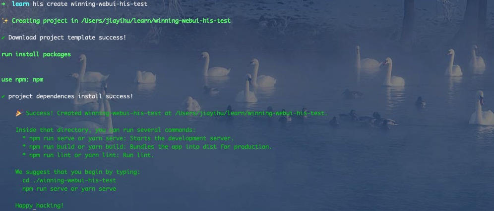
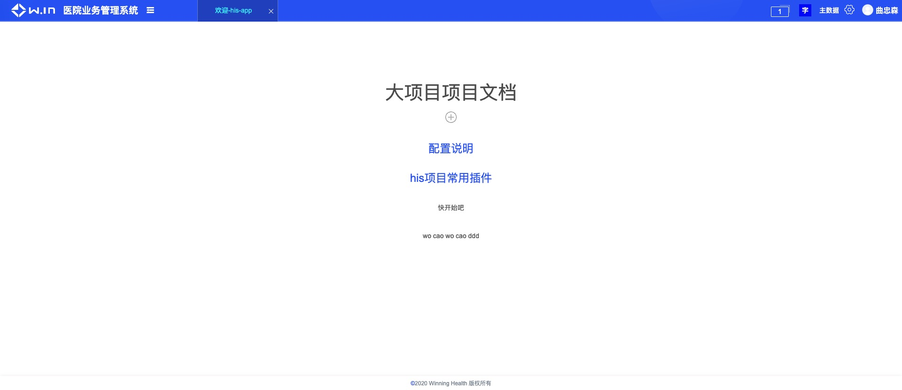

<!--
 * @Author: smallalso<hu141418@gmail.com>
 * @Date: 2020-12-16 10:55:33
 * @LastEditors: smallalso<hu141418@gmail.com>
 * @LastEditTime: 2020-12-18 17:20:31
 * @FilePath: /his-doc/docs/guide/quick-start.md
-->

## 起步

本节主要示范在面对一个新的项目，如何一步步生成项目到本地开发

### 流程

> 在前面两节主要讲了，his项目使用的技术方案和本地开发实现思路，为了配合实现这些想法，我们开发了一系列工具，这里主要讲在如何生成一个新的his项目，它主要使用 `his-cli`

当产品有需求需要新增一个项目时:

__第一步__ 

申请git仓库，这里默认申请了git仓库：winning-web-his-test

__第二步__ 

这里默认你下载了最新的 `his-cli`

```javascript
 his create winning-webui-his-test
```

如果顺利你将看到这个样子



如何 npm 下载失败了也没事，自己进入项目 重新install 就可以了

__第三步__ 

将本地项目 winning-web-his-test push 到 仓库

```shell
 cd ./winning-webui-his-test
 git remote add origin url(git repository address)
 git add .
 git commit -m "init project"
 git push -u origin master
```

__第四步__

```javascript
  npm run serve or yarn serve
```
如果顺利你将看到这个样子, 你可以修改初始化模版，开发自己的业务了



__第五步__

**在新建了一个子项目后，如何高效的本地开发调试成为一个重要问题，请看下一篇 [本地开发](./introduction.html)**。

更多配置信息，请查看 [`工具模块`](/tool/)
