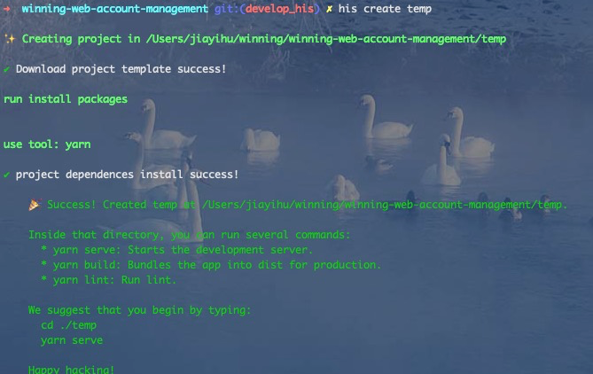
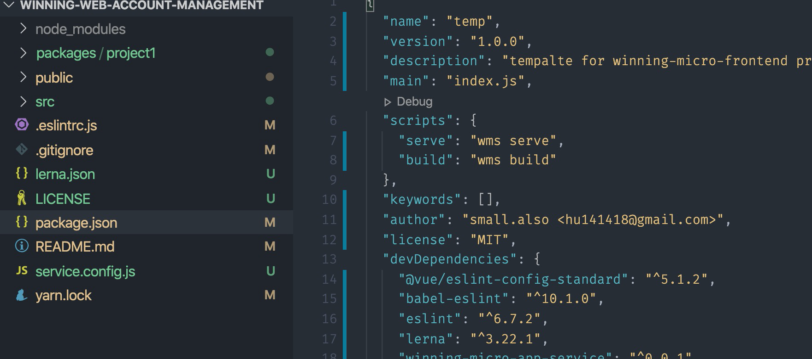
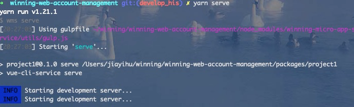

## 改造步骤

改造的工作是复杂繁琐的，为了在一定程度上减少改造成本、同时统一大 his 项目规范、减少项目后期维护成本。我们提供了大 his 项目初始化工具 his-cli。

### 在现有项目基础上新建 develop_his 分支。

### 删除 develop_his 分支下所有文件

### 在 develop_his 分支中 使用 his-cli 工具初始化项目

> 注意：请确保 npm 源地址为 winning 私服 http://nexus.winning.com.cn:8081/repository/npm-group/， 建议使用 源管理 nrm 管理

#### 创建模版项目

#### 将 temp 文件夹内所有文件移到 temp 文件夹外并删除 空的 temp 临时文件夹

#### 在 develop_his 分支下执行命令 yarn serve or npm run serve 查看能否在本地启动成功

### 将之前的老代码（develop 分支）迁移到新建的项目中（develop_his 分支）

重点：总体思路是将之前的功能页面改造为独立微应用子项目

#### 查看 develop 分支下有那些功能菜单，可以先迁移某个功能菜单(修改 packages/project1 为某个子模块)

> 注意: 同步修改配置文件 service.cofig.js

#### 将之前的 acctManagemet 模块 代码 迁移到 packages/acctManagement，注意之前一些公用的 store、公用的样式、图片样式等迁移

### 大 his 项目模版

- his 脚手架地址 [https://github.com/winning-finance/his-cli](https://github.com/winning-finance/his-cli)（私有项目，需要权限，有问题直接发 his 改造群）
- 主项目模版 [https://github.com/winning-finance/winning-micro-frontend-template](https://github.com/winning-finance/winning-micro-frontend-template)
- 子项目模版 [https://github.com/winning-finance/sub-micro-app-vue-template](https://github.com/winning-finance/sub-micro-app-vue-template)
