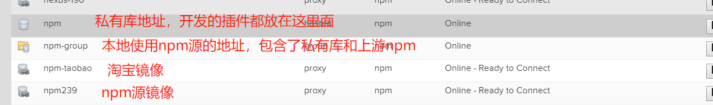
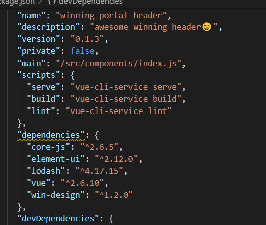

## 私有npm库的发布与使用

> 首先本地开发推荐使用nrm管理npm仓库 [https://github.com/Pana/nrm](https://github.com/Pana/nrm)

### nexus私有npm库简单介绍
[http://172.16.190.239:8081/repository/npm-group/](http://172.16.190.239:8081/repository/npm-group/)



### 如何发布一个npm私有包

发布模式基本与发布一个基本npm包方式相同 [https://www.jianshu.com/p/7bba18925fbf](https://www.jianshu.com/p/7bba18925fbf) ，不同的是你需要指定仓库为公司的私有仓库，这边暂定npm-6.0-hosted为私有库地址<br>

以最近写的头部组件为例，项目中你需要package.json文件并写上相关基本信息<br>



> 这边默认你已经安装了nrm，并且会使用

### 操作步骤：

1.首先添加npm源

```javascript
nrm add npm-hosted http://nexus.winning.com.cn:8081/repository/npm/
nrm use npm-hosted
```

2.需要登录 默认账号和密码，暂时使用admin

```javascript
npm login
```

3.登录成功后直接发布

```javascript
npm publish
```

### 私有库的使用

添加npm-group仓库，大家要注意发布仓库和使用仓库不同，使用仓库里面包含npm镜像和私有库

```javascript
nrm add winning http://nexus.winning.com.cn:8081/repository/npm-group/
nrm use winning
npm i
```