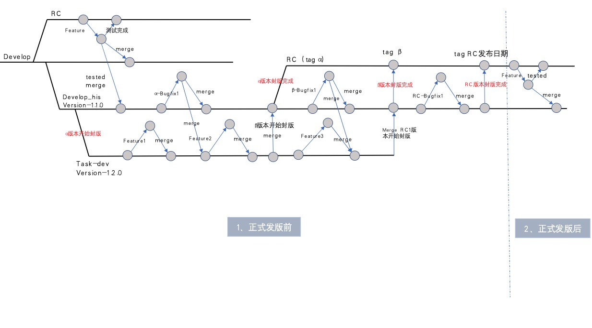

## 大his分支策略管理

为确保产品有序更新迭代，有必要统一大his前端代码分支管理策略

### 示意图

一、门诊、his共用项目

- RC 现场分支
- develop 门诊开开发分支
- develop_his his开发分支
- task/xxx 需求开发分支
- feature/xxx 任务开发分支

二、 his 独立的项目

- RC 现场分支
- develop 稳定演示分支
- develop_his his开发分支
- task/xxx 需求开发分支
- feature/xxx 任务开发分支

三、需求管理原始文档

[需求迭代管理文档](https://winwiki.winning.com.cn/pages/viewpage.action?pageId=20402513&preview=/20402513/20402514/%E5%A4%A7HIS%E5%88%86%E6%94%AF%E7%AD%96%E7%95%A5%E7%AE%A1%E7%90%86%E5%8A%9E%E6%B3%95.docx)
