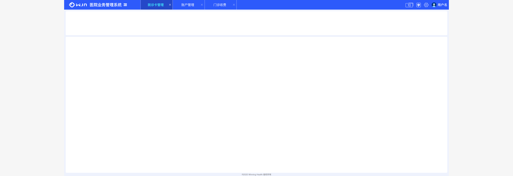
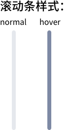
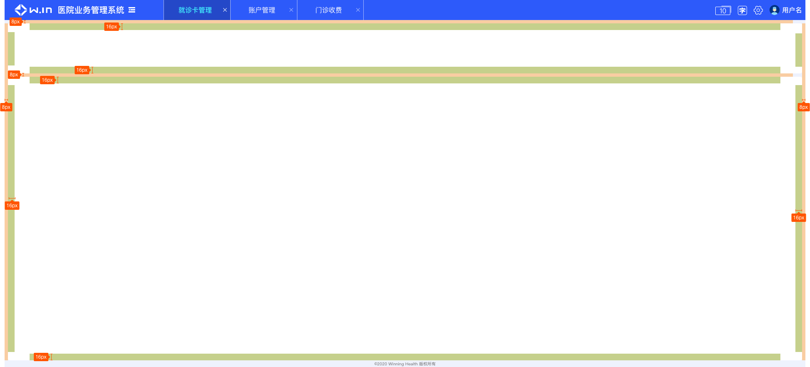

<!--
 * @Author: smallalso<hu141418@gmail.com>
 * @Date: 2020-12-16 20:41:02
 * @LastEditors: smallalso<hu141418@gmail.com>
 * @LastEditTime: 2020-12-17 14:53:52
 * @FilePath: /his-doc/docs/standard/index.md
-->

## UI规范

这里主要讲述 his 产品的设计规范，以保证各个子应用看起来风格统一

### 布局

HIS布局规定的最大宽度为1920px，最小宽度为1336px。当页面宽度超过1920px后，布局垂直居中，多余空白部分由底色填充。

当页面宽度小于1920px时，布局中部分内容可能出现横向滚动条。当页面宽度小于1336px时，整体布局会出现横向滚动条。

__整体布局分三块：__

① 顶部导航：高度为48px，宽度依据页面整体宽度自适应，且常居于顶部。

② 主体内容：高度依据内容决定，宽度依据页面整体宽度自适应。左右两侧各有8px外边距，距离顶部、内部分区都有8px的上边距。
主体四个角各有4px的圆角，内部分区底色**不添加任何阴影**。超出部分底色为 __#F6F6F6__，内容区域底色为色板6号色。

③ 版权信息：高度为16px，字体大小为10px，颜色为#666666。居于页面最底部，不覆盖于任何内容之上。

### 滚动条

由于面临可能大部分显示器分辨率都不高的情况，所以我们希望滚动条在通常情况下不太显眼，但是在hover时能给使用者一个显眼的效果。

所以在这里规定：滚动条normal状态下宽度为8px，圆角4px，颜色为20%透明度的色板icon色。hover状态下宽度为8px，圆角4px，颜色为色板icon色。

*关于色板，请参考WiNEX设计规范内容。

注意： **前端在写代码是强制使用element-ui 中的 ElScrollbar 组件，以便滚动条管理**

### 边距

HIS的边距以8px为基础单位，成倍数增长或缩小。
外边距推荐使用8px，内边距推荐使用16px。无论外边距或内边距，我们建议最小的距离都是4px，以保证视觉效果。

### 字体

无需关心 使用 winning-components 中的字体即可

### 背景色

正常情况下内容区域都用白色 __#ffffff__

### 字体颜色

为了达到更醒目的显示效果，我们在这里建议常规情况下只使用两种颜色。
常规的字体颜色为 __#000000__，提示、禁用时字体颜色为 __#999999__。

### 卡片阴影

- 基础投影： 投影长但色浅 box-shadow:0 2px 12px rgba(0,0,0,.08)
- 深色投影： 投影短但色深 box-shadow:0 2px 4px rgba(0,0,0,.12)
