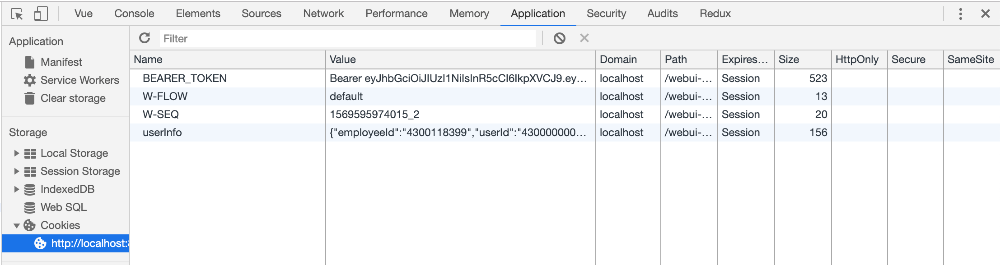

<!--
 * @Author: smallalso<hu141418@gmail.com>
 * @Date: 2020-12-16 21:30:11
 * @LastEditors: smallalso<hu141418@gmail.com>
 * @LastEditTime: 2020-12-18 11:00:59
 * @FilePath: /his-doc/docs/tool/winning-cookie-webpack-plugin.md
-->
## webpack 自动登陆插件

插件 winning-cookie-webpack-plugin 使用

<!-- <div align="center">
<a href="https://github.com/webpack/webpack">
    
  </a>
</div>
<div align="center">
<a>
=4.0-<颜色>.svg">
</a>
</div> -->

## 功能描述
针对Win6.0项目中，各小组前端项目没有登录页面，导致每次开发必须去测试环境登录获取token和userInfo信息，手动写入cookie，不利于开发工作。
故写此插件。只需传入相关参数即可在webpack构建时发请求获取信息自动写入相关cookie。


## 使用方法

安装
```shell
yarn add winning-cookie-webpack-plugin --dev
```

vue.config.js中加入

```js
const WinCookiePlugin = require('winning-cookie-webpack-plugin')

module.exports = {
  chainWebpack: (config) => {
    config.when(process.env.NODE_ENV === 'development', config => {
      config.plugin('WinCookiePlugin').use(WinCookiePlugin,[{
          userInfo: {
            loginURL: 'xxxx', // 登录地址URL
            userInfoURL: 'xxxx', // 获取用户信息URL
            username: 'xxx', // 登录用户名
            password: 'xxxx' // 登录密码
          },
          extraCookies: {}
      }])
    })
  }
}

```
浏览器效果：




## 参数说明

|  Param Name  | Required | Type |Description |
|--------|----------|--------|-------|
| userInfoParams   | 可选    | Object  | |获取token和登录用户信息字段,不传时使用默认参数 |
| userInfoParams.loginURL   | 当传入userInfoParams时必须   |String  | 登录地址URL |
| userInfoParams.userInfoURL   | 当传入userInfoParams时必须   |Stirng  | 获取用户信息URL |
| userInfoParams.username   | 当传入userInfoParams时必须     |String |登录用户名 |
| userInfoParams.password| 当传入userInfoParams时必须|  String |登录密码 |
|extraCookies| 可选 | Object|需要写入的额外cookies对象|


## 注意事项

目前的策略是当且仅当登录接口和用户信息接口返回成功才写入所有cookie。