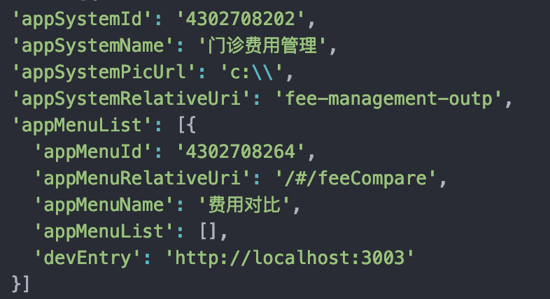

## 项目背景

由于追求操作的更加便利、更加人性化，大 his 项目将以功能菜单为单位实现

- 不同系统的功能菜单自由组合成新的系统（用户可以将不同系统的功能菜单组合成它的日常使用系统）
- 大 his 系统之间能够随意切换（避免用户切换系统需要回到 portal 页面然后重新进入某个系统）
- 大 his 头部导航菜单可动态新增删除

## 技术方案

现有的大 his 前端项目均为 spa 单页面应用，系统之间无法切换、即使强行使用 iframe 包裹不同系统，也会有面临诸多不可接受的体验问题

- 遮罩层无法覆盖全屏
- 功能菜单之间通信难
- header 头部重复
- iframe 内页面刷新无法保持状态

所以我们采用目前正在流行开来的微前端解决方案，采用阿里的微前端实现库 [qiankun](https://qiankun.umijs.org/zh) 来改造现有的大 his 项目。

### 主应用
**微前端概念系统中分为`主应用`和`子应用`，大his前端框架的主应用为[winning-web-his-main](http://tfs2018-web.winning.com.cn:8080/tfs/WINNING-6.0/WiNEX-HospitalAdministration/_git/winning-web-his-main)**，其包括头部、脚部、同时负责加载子项目，所以大家在开发子页面（子项目）的时候不需要考虑这部分功能了，这也是实现菜单可以收藏的基本原理。**为了提高开发人员研发效率，主应用除了线上部署加载子应用外，主应用还以npm包的形式对外暴露接口，让开发人员的开发环境就是真正的线上环境，便于发现及解决问题**。

### 子应用
我们将项目拆分为不同的子项目（也就是功能菜单），所有子项目由同一个基座加载组合成为一个系统。

推荐由我们提供的脚本下载生成子项目结构模板，项目模板会自带主应用的npm包，

#### 框架数据流向

- 主应用菜单接口：/finance-common/api/v1/app_finance_common/app_system_and_menu/query/by_user_id
- 主应用菜单数据结构：
  

  菜单取的跳转地址，取的是 appMenuRelativeUri，项目会将除'/'之外的字符去除，最终的格式一定是‘systemName/menuName’，因此要保证服务器中存在此路径，所以在开发时必须将子应用的文件夹名与 menuName’一致，然后构建脚本会将创建 menuName 文件夹存放子应用生产包，部署后服务器才能正常访问到，不然找不到文件夹导致访问 404.

  > 总结：子应用项目的文件夹名必须与接口返回的 appMenuRelativeUri 中的菜单名称一致，子应用 package.json 中的 name 字段必须保证唯一，一般采用 systemName-menuName 形式。

  故此在项目根目录中的 service.config.js 中的 menu 数据即是 mock 数据，而不是取接口数据，用以完善子应用本地开发过程中，可以看到项目完整效果。
