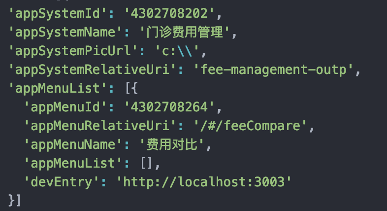

# 大 his 项目开发前必读

## 开发前必须要了解的事情

### 项目背景

此项目为基于 qiankun 的微前端架构，摒弃了 iframe。微前端的资料可查看 [qiankun 官网](https://qiankun.umijs.org/zh)了解。

### 项目结构

微前端分为主应用与子应用的 2 个概念。

- 主应用：用通俗的话来说就是一个负责加载子应用的容器，目前大 HIS 的主应用为 winning-web-his-main 项目

- 子应用：一个完整的项目结构，可单独部署，单独访问。

> 目前主应用已发布 npm，主应用中适配了子应用开发模式，让子应用在开发过程中直接访问 his-main，查看项目效果。

### 项目数据流向

- 主应用菜单接口：/finance-common/api/v1/app_finance_common/app_system_and_menu/query/by_user_id
- 主应用菜单数据结构：
  

  菜单取的跳转地址，取的是 appMenuRelativeUri，项目会将除'/'之外的字符去除，最终的格式一定是‘systemName/menuName’，因此要保证服务器中存在此路径，所以在开发时必须将子应用的文件夹名与 menuName’一致，然后构建脚本会将创建 menuName 文件夹存放子应用生产包，部署后服务器才能正常访问到，不然找不到文件夹导致访问 404.

  > 总结：子应用项目的文件夹名必须与接口返回的 appMenuRelativeUri 中的菜单名称一致，子应用 package.json 中的 name 字段必须保证唯一，一般采用 systemName-menuName 形式。

  故此在项目根目录中的 service.config.js 中的 menu 数据即是 mock 数据，而不是取接口数据，用以完善子应用本地开发过程中，可以看到项目完整效果。

## 业务系统配置

配置文件：service.config.js，放置与项目根目录，与 vue.config.js 位置相同

**options**

- `build`
- `menu` 开发模式下，配置的子应用数据，用于显示菜单
- `startMenuIds` 默认启动的子应用 id，只作用于开放环境
- `proxy` 代理设置
- `cookiePluginOptions` 自动登陆插件（支持配置 seq）

### build

| 参数     | 说明               | 类型   | 可选值 | 默认值   |
| :------- | :----------------- | :----- | :----- | -------- |
| packages | 子应用父级包名     | string | -      | packages |
| dist     | 同 webpack 的 dist | string | -      | dist     |

### menu

menu 配置只为开发模式服务，跟生产环境无关，生产环境统一走接口。
| 参数 | 说明 | 类型 | 可选值 | 默认值 |
| :------- | :----------------- | :----- | :----- | -------- |
| appSystemId | 系统 id（暂时没用） | string | - | - |
| appSystemName | 系统名称(暂时没用) | string | - | - |
| appSystemRelativeUri | 暂时没用 | string | - | - |
| appMenuList | 系统菜单列表 | array | - | - |

#### menu.appMenuList

menu 配置只为开发模式服务，跟生产环境无关，生产环境统一走接口。
| 参数 | 说明 | 类型 | 可选值 | 默认值 |
| :------- | :----------------- | :----- | :----- | -------- |
| name | 项目英文名（与子应用文件夹名相同 ） | string | - | - |
| appMenuId | 菜单的唯一标识（必须唯一） | string | - | - |
| appMenuName | 显示的菜单名称 | string | - | - |
| appMenuRelativeUri | 暂时没用 | string | - | - |
| devEntry | 子应用访问地址 | string | - | - |

### startMenuIds

配置默认启动的子应用。
类型：`Array<appMenuId> | null`，子应用（菜单）唯一标识 appMenuId。
不传此字段时时，系统默认启动项目中 packages 下所有文件夹下的子应用，根据子应用个数配置，可减少编译时间。

### proxy

配置系统接口代理，与 webpack-dev-server 的 proxy 一致。在项目根目录 vue.config.js 中配置亦可。

### cookiePluginOptions

| 参数           | 说&nbsp;明&nbsp;&nbsp;&nbsp;&nbsp;&nbsp;&nbsp;&nbsp;&nbsp;&nbsp;&nbsp;&nbsp;&nbsp; | 类型   | 可选值 | 默认值                                                                                                                                                                                                        |
| :------------- | :--------------------------------------------------------------------------------- | :----- | :----- | ------------------------------------------------------------------------------------------------------------------------------------------------------------------------------------------------------------- |
| userInfoParams | 自动登陆配置，包括  1.登陆接口 url   2.账号、密码                      | object | -      | userInfoParams: { loginURL: 'http://172.16.6.213/base/api/v1/base/user/login', userInfoURL: 'http://172.16.6.213/base/api/v1/base/user/get_information', username: 'L10044', password: '456' } |
| extraCookies   | 开发是金丝雀参数配置                                                               | string | -      | -                                                                                                                                                                                                             |
